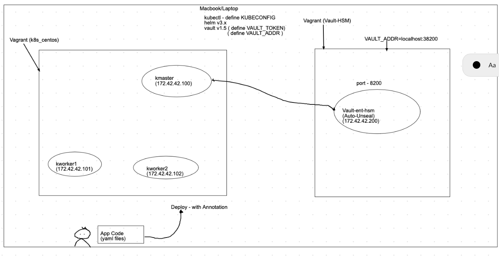
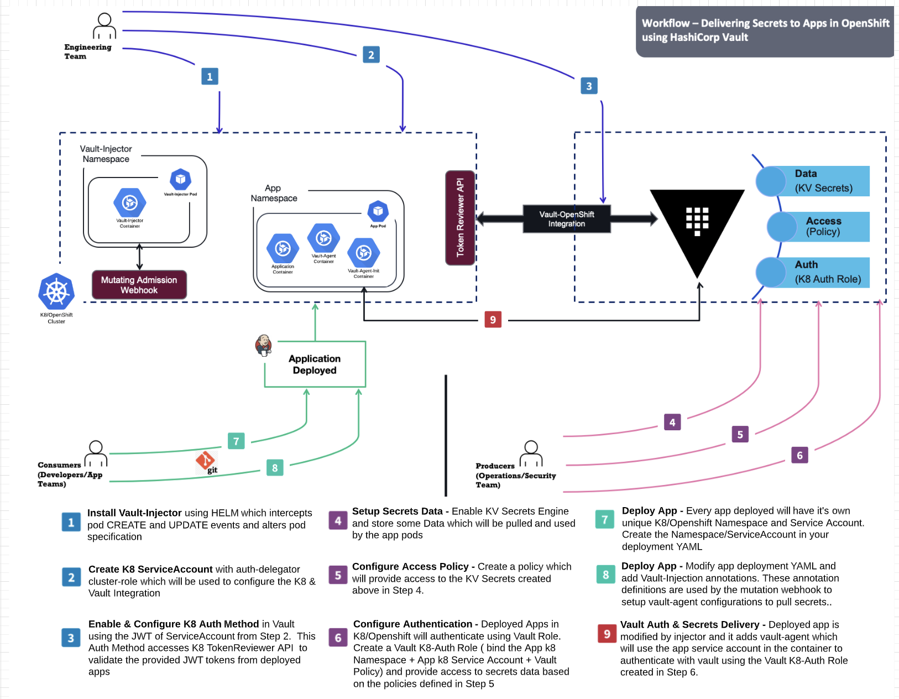

NOTE - NOTE - NOTE -- look at .gitignore file. make sure don't expose the sensitive data
This repo is built on k8s_centos.

More detailed article can be found below.
https://medium.com/hashicorp-engineering/consuming-secrets-in-your-openshift-applications-using-hashicorp-vault-injector-4fbf84156e7f

Here's an image of a drag racer in action:




# Vagrant Script to spin K8 cluster & Vault Server
- spins 3 images for k8 (one master node, two worker nodes)
- spins 1 image running Vault Server
- Vault is running outside k8 cluster
- Note - all vargant images will use 172.42.42.10x network

# Start K8 Cluster
```
⇒ cd k8s_centos
⇒ vagrant up
```

# Start Vault Cluster
```
# Note - copy your licenses into vault-vagrant/vault.lic file. else vault setup fails.
# vault-vagrant/vault.lic - this file has vault license string. Make sure this is in .gitignore
# Don't upload your licenses here.
# Note - The vagrant will download the vault ent+hsm binary from release.hashicorp.com site
# Image is using Soft HSM for auto-seal/unseal
# You can configure which version of Vault to be downloaded in scripts folder.
# Important notes above
```

```
⇒ cp vault.lic vault-vagrant
⇒ cd vault-vagrant
⇒ vagrant up
```

# Install kubectl & helm on your client machine (laptop)
```
⇒ brew install kubernetes-cli
(or)
follow the link --> https://kubernetes.io/docs/tasks/tools/install-kubectl/

# Install helm
$ brew install helm

-- verify your kubectl works.
⇒  kubectl version --short

```


# Configure your kubeconfig file. Set the env variable to read the config files. 
- This is needed if you are running multiple k8 clusters and connect to them accordingly
```
Configure the KUBECONFIG env variable to read the config for your k8 cluster. 
You can copy the config file from your k8 master to your CLI.

KUBECONFIG=/Users/RAMBO/.kube/custom-contexts/vagrant-k8/config.yml:/Users/RAMBO/.kube/config

# Shows the various clusters configured
⇒  kubectl config get-contexts
CURRENT   NAME                          CLUSTER          AUTHINFO           NAMESPACE
          docker-desktop                docker-desktop   docker-desktop
          docker-for-desktop            docker-desktop   docker-desktop
*         kubernetes-admin@kubernetes   kubernetes       kubernetes-admin

Note, the * above, it shows which cluster you are connecting. Command below shows you the current context or cluster kubectl will is connecting.

⇒  kubectl config current-context
kubernetes-admin@kubernetes

⇒  kubectl config use-context <context-name> (Switching from one context to another)

# Check Component Status
⇒  kubectl get cs
NAME                 STATUS    MESSAGE             ERROR
scheduler            Healthy   ok
controller-manager   Healthy   ok
etcd-0               Healthy   {"health":"true"}

# Get nodes
⇒  kubectl get nodes
NAME                   STATUS   ROLES    AGE   VERSION
kmaster.example.com    Ready    master   46m   v1.18.4
kworker1.example.com   Ready    <none>   41m   v1.18.4
kworker2.example.com   Ready    <none>   34m   v1.18.4
          
# Get pods
⇒  kubectl get pods --all-namespaces
NAMESPACE     NAME                                          READY   STATUS    RESTARTS   AGE
kube-system   calico-kube-controllers-5fbfc9dfb6-wh656      1/1     Running   0          46m
kube-system   calico-node-69bdj                             1/1     Running   0          41m
kube-system   calico-node-6cg47                             1/1     Running   0          46m
kube-system   calico-node-lfmvb                             1/1     Running   0          35m
kube-system   coredns-66bff467f8-28rfz                      1/1     Running   0          46m
kube-system   coredns-66bff467f8-jc62z                      1/1     Running   0          46m
kube-system   etcd-kmaster.example.com                      1/1     Running   0          46m
kube-system   kube-apiserver-kmaster.example.com            1/1     Running   0          46m
kube-system   kube-controller-manager-kmaster.example.com   1/1     Running   0          46m
kube-system   kube-proxy-bf7nt                              1/1     Running   0          46m
kube-system   kube-proxy-kwmn5                              1/1     Running   0          41m
kube-system   kube-proxy-qcn5j                              1/1     Running   0          35m
kube-system   kube-scheduler-kmaster.example.com            1/1     Running   0          46m

⇒  docker version
Client: Docker Engine - Community
 Version:           19.03.11
 API version:       1.40
 Go version:        go1.13.10
 Git commit:        42e35e61f3
 Built:             Mon Jun  1 09:13:48 2020
 OS/Arch:           linux/amd64
 Experimental:      false

Server: Docker Engine - Community
 Engine:
  Version:          19.03.11
  API version:      1.40 (minimum version 1.12)
  Go version:       go1.13.10
  Git commit:       42e35e61f3
  Built:            Mon Jun  1 09:12:26 2020
  OS/Arch:          linux/amd64
  Experimental:     false
 containerd:
  Version:          1.2.13
  GitCommit:        7ad184331fa3e55e52b890ea95e65ba581ae3429
 runc:
  Version:          1.0.0-rc10
  GitCommit:        dc9208a3303feef5b3839f4323d9beb36df0a9dd
 docker-init:
  Version:          0.18.0
  GitCommit:        fec3683
```

# Install k8 UI
```
⇒  cd yaml-files

⇒  kubectl apply -f kubernetes-dashboard.yml
namespace/kubernetes-dashboard created
serviceaccount/kubernetes-dashboard created
service/kubernetes-dashboard created
secret/kubernetes-dashboard-certs created
secret/kubernetes-dashboard-csrf created
secret/kubernetes-dashboard-key-holder created
configmap/kubernetes-dashboard-settings created
role.rbac.authorization.k8s.io/kubernetes-dashboard created
clusterrole.rbac.authorization.k8s.io/kubernetes-dashboard created
rolebinding.rbac.authorization.k8s.io/kubernetes-dashboard created
clusterrolebinding.rbac.authorization.k8s.io/kubernetes-dashboard created
deployment.apps/kubernetes-dashboard created
service/dashboard-metrics-scraper created
deployment.apps/dashboard-metrics-scraper created

Create a admin user to log into the UI.
⇒  kubectl apply -f dashboard-admin-user.yaml
serviceaccount/admin-user created
clusterrolebinding.rbac.authorization.k8s.io/admin-user created

Get the bearer token.
⇒  kubectl -n kubernetes-dashboard describe secret $(kubectl -n kubernetes-dashboard get secret | grep admin-user | awk '{print $1}')

⇒  kubectl proxy
Starting to serve on 127.0.0.1:8001

Now access Dashboard at:

http://localhost:8001/api/v1/namespaces/kubernetes-dashboard/services/https:kubernetes-dashboard:/proxy/

Some more useful urls
https://kubernetes.io/docs/tasks/access-application-cluster/web-ui-dashboard/
https://raw.githubusercontent.com/kubernetes/dashboard/v2.0.0/aio/deploy/recommended.yaml
```

# Install CURL and JQ on the kmaster
```
vagrant ssh kmaster
sudo yum -y install https://dl.fedoraproject.org/pub/epel/epel-release-latest-7.noarch.rpm
sudo yum install jq -y
sudo yum install curl
```


